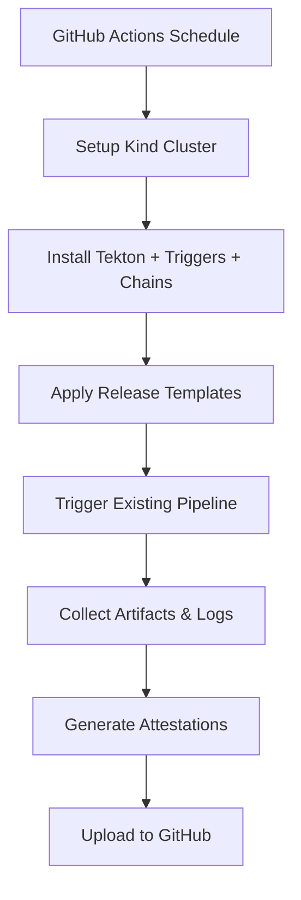

# GitHub Actions Nightly Releases

This directory contains GitHub Actions workflows that replace the Azure-hosted Tekton cronjobs for nightly releases. This implementation uses ephemeral Tekton clusters to run the existing release pipelines without requiring persistent infrastructure.

## Architecture

### Option 1: Ephemeral Tekton (Current Implementation)


```mermaid
graph TB
    A[GitHub Actions Schedule] --> B[Setup Kind Cluster]
    B --> C[Install Tekton + Triggers + Chains]
    C --> D[Apply Release Templates]
    D --> E[Trigger Existing Pipeline]
    E --> F[Collect Artifacts & Logs]
    F --> G[Generate Attestations]
    G --> H[Upload to GitHub]
```

### Key Components

1. **Setup Action** (`.github/actions/setup-tekton/`)
   - Creates Kind cluster with Docker-in-Docker
   - Installs Tekton Pipeline, Triggers, and Chains
   - Configures Chains for sigstore signing with GitHub OIDC
   - Sets up namespaces and RBAC

2. **Reusable Template** (`nightly-release-template.yml`)
   - Shared workflow logic for all projects
   - Handles cluster setup, pipeline execution, and artifact collection
   - Generates comprehensive execution reports

3. **Project-Specific Workflows**
   - `nightly-pipeline.yml` - Tekton Pipeline releases
   - `nightly-triggers.yml` - Tekton Triggers releases  
   - `nightly-dashboard.yml` - Tekton Dashboard releases
   - `nightly-chains.yml` - Tekton Chains releases
   - `nightly-operator.yml` - Tekton Operator releases

4. **Plumbing Component Workflow**
   - `nightly-plumbing-components.yml` - All plumbing-specific components
     - add-pr-body interceptor
     - add-pr-body-ci cluster interceptor
     - add-team-members interceptor
     - pr-commenter custom task
     - pr-status-updater custom task

## Features

### ✅ Preserved from Original System
- **Existing Tekton Pipelines** - No changes to release logic
- **Signed Artifacts** - Tekton Chains with sigstore integration
- **Scheduled Execution** - Cron-based nightly builds
- **Multiple Projects** - Support for all 11+ Tekton projects

### ✅ New Capabilities
- **GitHub Integration** - Native artifact attestations
- **Execution History** - Stored in GitHub Actions logs
- **Manual Triggers** - Workflow dispatch for testing
- **Parallel Execution** - No shared cluster contention

## Complete Coverage

### Tekton Core Projects
| Project | Workflow | Schedule | Status |
|---------|----------|----------|--------|
| Pipeline | `nightly-pipeline.yml` | 5am UTC | ✅ |
| Triggers | `nightly-triggers.yml` | 6am UTC | ✅ |
| Dashboard | `nightly-dashboard.yml` | 7am UTC | ✅ |
| Chains | `nightly-chains.yml` | 8am UTC | ✅ |
| Operator | `nightly-operator.yml` | 4am UTC | ✅ |

### Plumbing Components
| Component | Path | Registry Path | Status |
|-----------|------|---------------|--------|
| add-pr-body | `tekton/ci/interceptors/add-pr-body` | `tektoncd/plumbing/interceptors/add-pr-body` | ✅ |
| add-pr-body-ci | `tekton/ci/cluster-interceptors/add-pr-body` | `tektoncd/plumbing/cluster-interceptors/add-pr-body` | ✅ |
| add-team-members | `tekton/ci/interceptors/add-team-members` | `tektoncd/plumbing/interceptors/add-team-members` | ✅ |
| pr-commenter | `tekton/ci/custom-tasks/pr-commenter` | `tektoncd/plumbing/custom-tasks/pr-commenter` | ✅ |
| pr-status-updater | `tekton/ci/custom-tasks/pr-status-updater` | `tektoncd/plumbing/custom-tasks/pr-status-updater` | ✅ |

All components are built in parallel via matrix strategy in `nightly-plumbing-components.yml` at 1am UTC.

## Usage

### Automatic Releases
All workflows run automatically on their scheduled times.

### Manual Testing
```bash
# Test individual Tekton project
gh workflow run nightly-pipeline.yml -f run-tests=false

# Test specific plumbing components
gh workflow run nightly-plumbing-components.yml -f components="add-pr-body,pr-commenter"

# Test all plumbing components
gh workflow run nightly-plumbing-components.yml -f components="all"
```

### Fork Testing
For testing in your fork:
1. Enable GitHub Actions in repository settings
2. Update container registry paths in workflows
3. Set up necessary secrets (if needed)

## Migration from Traditional Cronjobs

### Advantages
- **Cost Efficiency**: No persistent cluster costs
- **Enhanced Security**: OIDC authentication, artifact attestations
- **Better Observability**: GitHub Actions logs and artifact management
- **Parallel Execution**: No resource contention between releases
- **Zero Maintenance**: No cluster upgrades or secret rotation

### Equivalency Mapping
| Traditional Cronjob | GitHub Actions Workflow |
|---------------------|-------------------------|
| `tekton/cronjobs/releases_azure/releases/pipeline-nightly/` | `.github/workflows/nightly-pipeline.yml` |
| `tekton/cronjobs/releases_azure/releases/triggers-nightly/` | `.github/workflows/nightly-triggers.yml` |
| `tekton/cronjobs/releases_azure/releases/dashboard-nightly/` | `.github/workflows/nightly-dashboard.yml` |
| `tekton/cronjobs/releases_azure/releases/chains-nightly/` | `.github/workflows/nightly-chains.yml` |
| `tekton/cronjobs/releases_azure/releases/operator-nightly/` | `.github/workflows/nightly-operator.yml` |
| `tekton/cronjobs/releases_azure/releases/add-pr-body-*` | `.github/workflows/nightly-plumbing-components.yml` |
| `tekton/cronjobs/releases_azure/releases/pr-*` | `.github/workflows/nightly-plumbing-components.yml` |

## Artifact Locations

### Container Images
- **Tekton Projects**: `ghcr.io/tektoncd/{project}:{version}`
- **Plumbing Components**: `ghcr.io/tektoncd/plumbing/{component-type}/{component}:{version}`

### Release Assets
- **GitHub Releases**: Attached to workflow runs with comprehensive logs
- **Artifact Storage**: Available via GitHub Actions artifacts API
- **Attestations**: Signed and verifiable via GitHub attestations API 