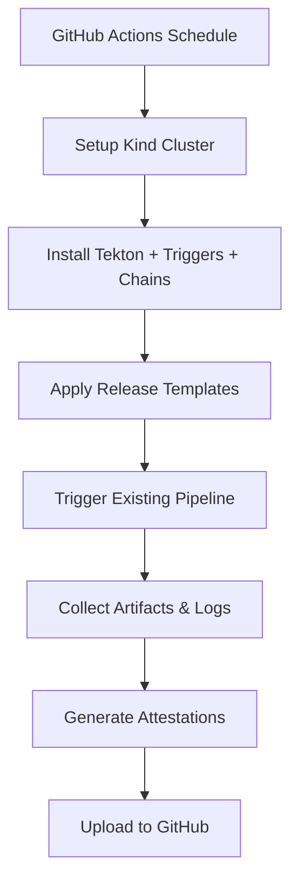

# GitHub Actions Nightly Releases

This directory contains GitHub Actions workflows that replace the Azure-hosted Tekton cronjobs for nightly releases. This implementation uses ephemeral Tekton clusters to run the existing release pipelines without requiring persistent infrastructure.

## Architecture

### Option 1: Ephemeral Tekton (Current Implementation)



### Key Components

1. **Setup Action** (`.github/actions/setup-tekton/`)
   - Creates Kind cluster with Docker-in-Docker
   - Installs Tekton Pipeline, Triggers, and Chains
   - Configures Chains for sigstore signing with GitHub OIDC
   - Sets up namespaces and RBAC

2. **Reusable Template** (`nightly-release-template.yml`)
   - Shared workflow logic for all projects
   - Handles cluster setup, pipeline execution, and artifact collection
   - Generates comprehensive execution reports

3. **Project-Specific Workflows**
   - `nightly-pipeline.yml` - Tekton Pipeline releases
   - `nightly-triggers.yml` - Tekton Triggers releases  
   - `nightly-dashboard.yml` - Tekton Dashboard releases
   - `nightly-chains.yml` - Tekton Chains releases

## Features

### ✅ Preserved from Original System
- **Existing Tekton Pipelines** - No changes to release logic
- **Signed Artifacts** - Tekton Chains with sigstore integration
- **Scheduled Execution** - Cron-based nightly builds
- **Multiple Projects** - Support for all 11+ Tekton projects

### ✅ New Capabilities
- **GitHub Integration** - Native artifact attestations
- **Execution History** - Stored in GitHub Actions logs
- **Manual Triggers** - Workflow dispatch for testing
- **Parallel Execution** - No shared cluster contention
- **Cost Effective** - No persistent infrastructure

### ⚠️ Trade-offs
- **Cold Start Overhead** - ~5-10 minutes to setup cluster
- **Resource Limits** - Constrained by GitHub runner limits
- **Log Storage** - Limited to GitHub's retention policies

## Usage

### Automatic Execution
Workflows run automatically on their configured schedules:
- Pipeline: Daily at 5am UTC
- Triggers: Daily at 6am UTC  
- Dashboard: Daily at 7am UTC
- Chains: Daily at 8am UTC

### Manual Execution
Trigger releases manually via GitHub UI:
1. Go to Actions tab
2. Select the desired nightly workflow
3. Click "Run workflow"
4. Optionally enable tests

### Monitoring
- **GitHub Actions UI** - Real-time execution status
- **Workflow Summaries** - High-level results and artifacts
- **Artifact Downloads** - Logs and pipeline outputs

## Signing and Attestations

### Tekton Chains Signing
- Uses GitHub OIDC tokens for keyless signing
- Integrates with public Sigstore/Rekor
- Maintains compatibility with existing verification tools

### GitHub Attestations  
- Native build provenance for containers
- SLSA-compliant attestation format
- Verifiable with `gh attestation verify`

## Migration Status

### ✅ Completed
- [x] Setup automation for Kind + Tekton
- [x] Reusable workflow template
- [x] Pipeline, Triggers, Dashboard, Chains workflows
- [x] Artifact collection and history
- [x] Documentation

### 🚧 Next Steps
1. **Add remaining projects** (operator, add-pr-body, etc.)
2. **Test with real releases** and validate output
3. **Disable Azure cronjobs** once validated
4. **Monitor and optimize** performance

### 📋 Validation Checklist
- [ ] Pipeline release produces correct artifacts
- [ ] Chains signing works with GitHub OIDC
- [ ] Attestations are properly generated
- [ ] Logs are collected and accessible
- [ ] Manual triggers work correctly

## Troubleshooting

### Common Issues

**Cluster Setup Fails**
```bash
# Check Docker daemon status
docker ps

# Verify Kind installation
kind version
```

**Pipeline Doesn't Trigger**
```bash
# Check EventListener status
kubectl get pods -n tekton-nightly -l app.kubernetes.io/name=el-pipeline-nightly

# Verify port-forward
kubectl port-forward -n tekton-nightly svc/el-pipeline-nightly 8080:8080
```

**Missing Artifacts**
```bash
# Check PipelineRun status
kubectl get pipelinerun -n tekton-nightly

# View detailed events
kubectl describe pipelinerun/PIPELINE_RUN_NAME -n tekton-nightly
```

### Debug Mode
Enable debug output by setting repository secret:
```
ACTIONS_STEP_DEBUG=true
```

## Future Improvements

### Short Term
- **Resource Optimization** - Tune cluster sizing for faster startup
- **Parallel Builds** - Run compatible projects simultaneously  
- **Better Reporting** - Enhanced summaries and notifications

### Long Term (Option 2)
- **Native GHA Conversion** - Replace Tekton with GitHub Actions
- **Distributed Workflows** - Per-repository release definitions
- **Advanced Attestations** - SBOM and vulnerability scanning

## Cost Analysis

### Current (Azure Hosted)
- **Persistent cluster costs** - $X/month (estimated)
- **Maintenance overhead** - Manual cluster management

### New (GitHub Actions)
- **Execution cost** - ~$0.008/minute for public repos (free)
- **Storage cost** - Artifact storage included in plan
- **Maintenance** - Fully automated, no infrastructure

## Support

For issues with the nightly release system:
1. Check [GitHub Actions status](https://www.githubstatus.com/)
2. Review workflow logs for specific errors
3. Open issues in the [plumbing repository](https://github.com/tektoncd/plumbing/issues)
4. Contact the Tekton release team in Slack (#release) 